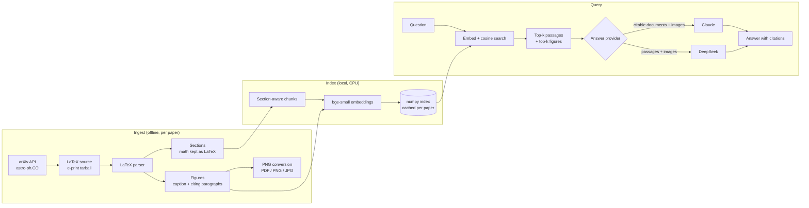

# Cosmology RAG

[](https://github.com/Aryen1103/cosmology-rag/actions/workflows/ci.yml)

**Multimodal retrieval-augmented generation over arXiv cosmology papers.**

Ask a question across a library of recent `astro-ph.CO` papers. The system
retrieves the most relevant text passages *and* figures, then a
vision-language model reads both, including the plots themselves, and answers
with citations back to the exact paper, section and figure.

> **Status: work in progress.** Ingestion, indexing and retrieval are built and
> tested on real papers. The answer step (Claude and DeepSeek) is implemented
> but not yet evaluated against the live APIs. A FastAPI backend and a React
> web app are working. A head-to-head model comparison is next. See
> [Roadmap](#roadmap).

---

## Contents

- [Why this project](#why-this-project)
- [Architecture](#architecture)
- [How it works](#how-it-works)
- [Design decisions](#design-decisions)
- [Results so far](#results-so-far)
- [Project structure](#project-structure)
- [Setup](#setup)
- [Usage](#usage)
- [Testing](#testing)
- [Known limitations](#known-limitations)
- [Roadmap](#roadmap)

---

## Why this project

Most "chat with your PDF" systems only read text. In cosmology papers, much of
the actual result lives in the **figures**: power spectra, posterior contours,
constraint plots. A text-only RAG system can tell you a figure exists but not
what it shows. This project treats figures as first-class retrievable sources
and hands the image itself to a model that can read it.

## Architecture



## How it works

### 1. Ingestion: arXiv LaTeX source instead of PDFs

For each paper, the ingester downloads the **LaTeX source** from arXiv's
e-print endpoint rather than the PDF. The parser then:

- finds the main `.tex` file (the one with `\documentclass`) and inlines every
  `\input` / `\include`,
- strips comments, front matter (title, authors, affiliations), the abstract
  (taken from arXiv metadata instead) and the bibliography,
- expands the paper's own zero-argument macros, so a custom `\hmpc` becomes
  `h^-1 Mpc` rather than silently vanishing,
- splits the text into a section hierarchy (`Results > Clustering`), marking
  appendices,
- keeps math as **raw LaTeX**, which the answering models read directly,
- turns `\cite{...}` into `[cite: key]` and `\ref{...}` into markers, so the
  parser knows which paragraphs discuss which figure.

Each figure gets a record with its caption, the image file(s), and the
paragraphs that reference it. Images are converted to PNG, sized to at most
1568 px on the long edge (the useful limit for Claude's vision input). PDF
figures are rasterised with PyMuPDF.

arXiv asks API users to wait ~3 s between requests, and the client enforces
that.

### 2. Indexing: text and figures in one vector space

- Sections are split into ~220-word chunks with 40-word overlap, breaking at
  paragraph boundaries where possible.
- Each chunk is embedded as `paper title | section path` + text, so short
  chunks keep their context.
- Each figure is embedded from its **caption plus the paragraphs that cite
  it**.
- Boilerplate sections (acknowledgements, data availability, software,
  funding, ...) are skipped. In testing they otherwise crowded out real
  results, because they match any query that mentions the paper's topic.
- Embeddings use [`BAAI/bge-small-en-v1.5`](https://huggingface.co/BAAI/bge-small-en-v1.5)
  locally on CPU and are cached per paper, keyed on a hash of the exact
  inputs, so rebuilding the index only embeds new or changed papers.

### 3. Retrieval

A question is embedded with bge's query instruction and compared against every
vector with a single matrix-vector product. The top text chunks and top figures
are ranked separately, so figures are never crowded out by the much larger
number of text chunks.

### 4. Answering: one interface, two providers

Retrieved sources are labelled `[S1]…` (passages) and `[F1]…` (figures) and
sent to a vision-language model along with the figure images.

| | Claude (`claude-opus-5`) | DeepSeek (`deepseek-flash`) |
|---|---|---|
| Figure images | Sent as image blocks | Sent as `image_url` parts (`detail: high`) |
| Citations | **Native API citations**: each passage is a citable document, and the response returns the exact quoted span behind every claim | Prompted `[S#]` / `[F#]` markers, checked against the real source list; markers naming nonexistent sources are flagged |
| Safety fallback | Server-side `fallbacks: "default"` re-routes a declined request | n/a |

Both providers receive identical sources, numbering and instructions, so their
answers can be compared fairly.

## Design decisions

**LaTeX source over PDF parsing.** Academic PDFs are usually two-column, and
text extractors tend to interleave the columns. An earlier project hit exactly
this class of bug with `pypdf` (spurious mid-word spaces). LaTeX source avoids
the whole problem and gives equations, captions, figure files and structure for
free. Papers submitted without source fall back to PDF text extraction.

**Figures are retrieved through their text, not only their pixels.** CLIP-style
image embeddings are trained on natural photographs and do poorly on power
spectra and corner plots. The caption and the paragraphs that cite a figure say
what the figure *means*, and in this corpus every figure has them. Image
embeddings may still be added later as a secondary signal.

**TikZ figures are kept, not dropped.** Some figures are drawn in LaTeX itself
and have no image file. Rendering them would need a full TeX install. They stay
searchable as caption-only figures, marked `inline_drawing` so the model is
told there is no image.

**Brute-force numpy search instead of a vector database.** A few hundred papers
means tens of thousands of vectors, which a matrix-vector product searches in
milliseconds. It also avoids another compiled dependency on the development
machine, whose security policy blocks some native Python extensions.

**No `sentence-transformers`.** It depends on scikit-learn, one of whose
compiled DLLs is blocked on the development machine. The embedding model runs
through plain `transformers` with CLS pooling, which is how bge is meant to be
used anyway.

**Two providers, decided by evidence.** Claude offers native citations and
higher-resolution image input. DeepSeek is far cheaper per token. Neither
provider publishes how well it reads dense scientific plots, so the plan is to
compare them on real figure questions from the corpus rather than choose from
spec sheets.

## Results so far

Ingestion run on the 20 most recent `astro-ph.CO` papers (September 2026):

| Metric | Result |
|---|---|
| Papers with LaTeX source available | 20 / 20 |
| Figures extracted | 112 |
| Figures with a caption | 112 / 112 |
| Labelled figures linked to citing paragraphs | 108 / 110 |
| Figures drawn inline (TikZ, caption-only) | 3 |
| EPS figures (unsupported without Ghostscript) | 0 |

Retrieval spot-checks: for questions like *"What value of H0 is obtained using
only the tip of the red giant branch?"*, *"What limits does LUX-ZEPLIN place on
primordial black hole evaporation?"* and *"Which figure shows how a peak in the
correlation function evolves?"*, the correct paper is retrieved every time, and
for the figure question the correct figure ranks first.

## Project structure

```
cosmology-rag/
├── backend/
│   ├── app/
│   │   ├── config.py            # paths, model names, .env loading
│   │   ├── main.py              # FastAPI: /api/ask, /api/search, /api/papers, figure images
│   │   ├── ingest/
│   │   │   ├── arxiv_client.py  # arXiv API search + e-print download (rate-limited)
│   │   │   ├── latex.py         # LaTeX -> sections, figures, citing paragraphs
│   │   │   ├── figures.py       # resolve \includegraphics paths, convert to PNG
│   │   │   └── pipeline.py      # unpack e-print, parse, write paper.json
│   │   ├── index/
│   │   │   ├── embeddings.py    # bge-small via transformers (CLS pooling)
│   │   │   └── store.py         # chunking, per-paper embedding cache, search
│   │   └── answer/
│   │       ├── base.py          # shared prompt, source labelling, citation checks
│   │       ├── claude.py        # Claude: citable documents + images
│   │       └── deepseek.py      # DeepSeek: chat completions + images
│   ├── scripts/
│   │   ├── ingest.py            # fetch + parse papers into data/papers/
│   │   ├── build_index.py       # embed into data/index/
│   │   └── ask.py               # ask a question from the command line
│   └── tests/
├── frontend/                    # React + Vite web app (proxies /api to the backend)
└── data/                        # generated, gitignored
    ├── papers/<arxiv_id>/       # paper.json, figures/*.png, cached embeddings
    └── index/                   # embeddings.npy, records.jsonl
```

## Setup

Requires Python 3.11+.

```bash
cd backend
python -m venv venv
./venv/Scripts/activate          # Windows
# source venv/bin/activate       # macOS / Linux

# CPU-only PyTorch (avoids a multi-GB CUDA download)
pip install torch --index-url https://download.pytorch.org/whl/cpu
pip install -r requirements-dev.txt
```

Copy `backend/.env.example` to `backend/.env` (which is gitignored) and fill in
the key for the provider you use:

```
ANTHROPIC_API_KEY=sk-ant-...     # console.anthropic.com
DEEPSEEK_API_KEY=sk-...          # platform.deepseek.com
```

Optional overrides: `CLAUDE_MODEL`, `DEEPSEEK_MODEL`.

The web app needs Node.js 20+:

```bash
cd frontend
npm install
```

## Usage

Steps 1–3 run from `backend/`.

**1. Ingest papers.** This fetches the newest papers matching an arXiv query
and parses them into `data/papers/`. Already-ingested papers are skipped.

```bash
python scripts/ingest.py --max 20
python scripts/ingest.py --query "cat:astro-ph.CO AND abs:BAO" --max 50
```

**2. Build the index.** The first run downloads the embedding model (~130 MB).
Later runs only embed new papers.

```bash
python scripts/build_index.py
```

**3. Ask questions.**

```bash
# Inspect what retrieval finds (no API call, no key needed)
python scripts/ask.py "What limits does LUX-ZEPLIN place on PBH evaporation?" --retrieval-only

# Answer with one provider, or both side by side
python scripts/ask.py "What H0 do they get from TRGB and geometric anchors alone?" --provider claude
python scripts/ask.py "What does the peak-evolution figure show?" --provider both
```

The output lists the retrieved sources with similarity scores, then each
provider's answer, token usage, latency and citations (with quoted text for
Claude).

**4. Use the web app.** Start the API, then the frontend dev server, and open
http://localhost:5173.

```bash
cd backend && uvicorn app.main:app --port 8000
cd frontend && npm run dev
```

Answers render Markdown and LaTeX. Citation markers are clickable and jump to
the source they cite, and figures open full size. **Search only** shows what
retrieval finds without calling a model. The Papers tab lists everything
ingested and warns when the index is behind. After rebuilding the index,
restart the API server so it loads the new one.

**Cost.** Each question sends roughly 8–10K input tokens (six passages and up
to three figures). With Claude Opus 5 that's about $0.05–0.07 per question.
DeepSeek costs a small fraction of that.

## Testing

```bash
cd backend
python -m pytest
```

The tests cover LaTeX parsing (nested braces, `\input` inlining, macro
expansion, comment stripping, front-matter and bibliography removal, figure and
caption extraction, TikZ detection), e-print unpacking (tarball, gzipped single
file, PDF), figure conversion, chunking, boilerplate filtering and citation
marker validation, plus the HTTP API: input validation, missing-key errors,
path-traversal protection on the figure route, and rate limiting. None of them
need network access or API keys.

**CI.** [GitHub Actions](.github/workflows/ci.yml) runs on every push and pull
request: pytest, the frontend lint and production build, and a Docker image
build.

## Docker

One image serves the API and the built web app. The corpus in `data/` is baked
in, so ingest and build the index first. API keys are never part of the image;
pass them at runtime.

```bash
docker build -t cosmology-rag .
docker run -p 8000:8000 --env-file backend/.env cosmology-rag   # http://localhost:8000
```

Runtime settings (environment variables):

| Variable | Purpose |
|---|---|
| `DEEPSEEK_API_KEY`, `ANTHROPIC_API_KEY` | Provider keys. Omit one to disable that provider. |
| `ASK_LIMIT_PER_IP_PER_HOUR` | Questions per client per hour (0 = unlimited, the default). |
| `ASK_LIMIT_PER_DAY` | Model calls per UTC day across all clients (0 = unlimited). |
| `ADMIN_TOKEN` | If set, `POST /api/reload-index` requires a matching `X-Admin-Token` header. |
| `PORT` | Listen port (default 8000). |

On a public deployment, set both limits. Every question spends your API credit,
and **Search only** stays available once the limits are reached.

## Deployment (Azure)

[`infra/azure/`](infra/azure/) holds Terraform for **Azure Container Apps**:
scale-to-zero consumption hosting, API keys held as Container Apps secrets,
capped log ingestion, and a single replica so the question limits hold. Deploys
go through a manual [GitHub Actions workflow](.github/workflows/deploy-azure.yml)
that logs in to Azure with OIDC (no stored credentials) and keeps Terraform state
in Azure Storage. CI runs `terraform fmt`, `validate` and plan-level
`terraform test` against a mocked provider on every push.

**Status:** deployment-ready and validated in CI, but not currently running on
Azure. See [infra/azure/README.md](infra/azure/README.md) for the architecture,
cost estimate, one-time setup and deploy steps.

## Known limitations

- **EPS figures** need Ghostscript to rasterise and are skipped without it
  (none appeared in the 20-paper sample).
- **LaTeX parsing is deliberately "good enough."** Macros that take arguments
  are not expanded, and unusual packages degrade to plain text rather than
  failing the paper.
- **Figures drawn in TikZ** have no image; the model only sees their caption.
- **Embedding is CPU-bound** (~0.3 s per chunk here), so first-time indexing
  of a few hundred papers takes a while. Caching makes later rebuilds fast.
- **DeepSeek citations are only as good as the model's markers.** Unlike
  Claude's, they don't come with a verified quote.

## Roadmap

- [x] arXiv LaTeX ingestion with figures, captions and citing context
- [x] Local embedding index with per-paper caching
- [x] Retrieval over text and figures
- [x] Claude and DeepSeek answer providers behind one interface
- [ ] Run and compare both providers on real figure questions
- [x] FastAPI backend + React frontend (answers with clickable citations and figure thumbnails)
- [x] Docker image, CI (pytest, frontend, Terraform, image build), Azure Container Apps infrastructure as code
- [ ] Go live on Azure
- [ ] Scale the corpus to a few hundred papers
- [ ] Optional: generated figure descriptions at ingest time for stronger figure retrieval
