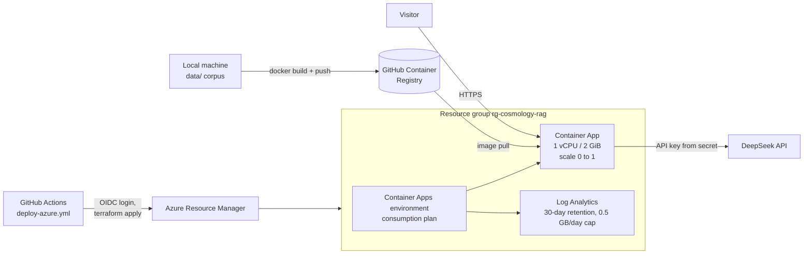

# Azure deployment (Terraform)

Infrastructure as code for running Cosmology RAG on **Azure Container Apps**. CI
checks it on every push (`terraform fmt`, `validate`, and plan-level `terraform
test` against a mocked provider). Deploying is a manual workflow run, because it
creates billable resources.

> **Status:** deployment-ready and validated in CI. The app is not currently
> running on Azure.

## Architecture



| Resource | Why |
|---|---|
| Container App | Runs the single image (API plus built frontend). Scales to zero when idle. HTTPS ingress, with health probes on `/api/health`. |
| Container Apps environment | Consumption plan: billed per second of use, nothing when scaled to zero. |
| Log Analytics workspace | Container logs, with a daily ingestion cap as a cost guardrail. |
| Container Apps secrets | Hold `DEEPSEEK_API_KEY` (and optionally `ANTHROPIC_API_KEY`), exposed to the container as secret references. They never go into the image, the repo or the Terraform variables files. |

Design choices:

- **Scale to zero, max one replica.** A portfolio demo is idle almost all the
  time, so scaling to zero keeps it close to free. The cost is a cold start of
  roughly 30–60 s (image pull, then loading the index and embedding model). The
  question limits are kept in memory, so the app must run as one replica. A
  variable validation and a test enforce this.
- **The image is built locally, not in CI.** The corpus (`data/`, ~650 MB of
  papers, figures and index) is generated by the ingest pipeline and gitignored,
  so only a machine with the corpus can build the deployable image.
- **OIDC, not stored Azure credentials.** GitHub Actions exchanges a short-lived
  token for Azure access, scoped to this repository's `production` environment.
- **Remote state** is kept in an Azure Storage container and accessed with Azure
  AD auth instead of storage account keys.

## Estimated cost

Container Apps' free monthly grant (180,000 vCPU-seconds and 360,000
GiB-seconds) covers about **50 hours of active time a month** at 1 vCPU / 2 GiB.
Idle time costs nothing when scaled to zero. Log Analytics includes 5 GB/month of
free ingestion, and state storage costs cents. Light demo traffic should
therefore cost about **$0**, plus DeepSeek usage (capped by the question
limits). With `min_replicas = 1` (always warm) it bills continuously, roughly
$30–40/month. Check current Azure pricing before deploying.

## One-time setup

Requires the [Azure CLI](https://learn.microsoft.com/cli/azure/install-azure-cli) and `gh`.

```bash
az login
SUB=$(az account show --query id -o tsv)
REPO=Aryen1103/cosmology-rag

# 1. Storage for Terraform state (the account name must be globally unique)
az group create -n rg-tfstate -l westeurope
az storage account create -n <tfstateUNIQUE> -g rg-tfstate --sku Standard_LRS \
  --min-tls-version TLS1_2 --allow-blob-public-access false
az storage container create -n tfstate --account-name <tfstateUNIQUE> --auth-mode login

# 2. An identity GitHub Actions can log in as (OIDC, no secret)
APP_ID=$(az ad app create --display-name gh-cosmology-rag-deploy --query appId -o tsv)
az ad sp create --id "$APP_ID"
az ad app federated-credential create --id "$APP_ID" --parameters '{
  "name": "github-production",
  "issuer": "https://token.actions.githubusercontent.com",
  "subject": "repo:'"$REPO"':environment:production",
  "audiences": ["api://AzureADTokenExchange"]
}'
az role assignment create --assignee "$APP_ID" --role Contributor --scope "/subscriptions/$SUB"
az role assignment create --assignee "$APP_ID" --role "Storage Blob Data Contributor" \
  --scope "$(az storage account show -n <tfstateUNIQUE> -g rg-tfstate --query id -o tsv)"

# 3. Repository secrets
gh secret set AZURE_CLIENT_ID --body "$APP_ID"
gh secret set AZURE_TENANT_ID --body "$(az account show --query tenantId -o tsv)"
gh secret set AZURE_SUBSCRIPTION_ID --body "$SUB"
gh secret set TFSTATE_RESOURCE_GROUP --body rg-tfstate
gh secret set TFSTATE_STORAGE_ACCOUNT --body <tfstateUNIQUE>
gh secret set DEEPSEEK_API_KEY    # paste when prompted, so it stays out of shell history
```

Optionally, add required reviewers to the `production` environment (repository
Settings → Environments), so every deploy needs an approval.

## Deploy

```bash
# 1. Build and push the image (from the repo root, with data/ populated)
TAG=ghcr.io/aryen1103/cosmology-rag:$(git rev-parse --short HEAD)
docker build -t "$TAG" .
gh auth token | docker login ghcr.io -u Aryen1103 --password-stdin   # needs write:packages
docker push "$TAG"
# Make the package public in GitHub (Packages → cosmology-rag → settings), or set the
# registry_* Terraform variables so Azure can pull a private image.

# 2. Preview, then apply
gh workflow run deploy-azure.yml -f image="$TAG" -f action=plan
gh workflow run deploy-azure.yml -f image="$TAG" -f action=apply
```

The apply run's summary shows the public URL.

## Tear down

```bash
az group delete -n rg-cosmology-rag --yes     # the app and everything it uses
az group delete -n rg-tfstate --yes           # Terraform state, if you're done for good
```

## Local checks (no Azure account needed)

```bash
cd infra/azure
terraform init -backend=false
terraform validate
terraform test        # plan-level tests with a mocked azurerm provider
```
